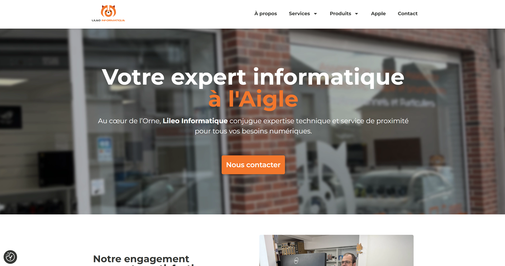

# Computer store - Website

## �� Project Overview

This is a professional website for a computer and technology services company located in L'Aigle, Orne, France. The website showcases their comprehensive IT services, products, and expertise in computer repair, maintenance, and sales.

## 🌐 Live Website

**URL:** [https://www.lileo-informatique.fr/](https://www.lileo-informatique.fr/)

## 🏢 Company Profile

The computer store is a specialized IT company offering:
- Computer sales and consultation
- Hardware repair and maintenance
- Network installation and configuration
- Apple product expertise
- Professional maintenance contracts
- VOIP telephony solutions
- EBP software partnership

## ��️ Technical Stack

- **Platform:** WordPress
- **Page Builder:** Elementor Pro
- **Hosting:** Professional web hosting
- **Language:** French

## 🎯 Key Features

### Core Functionality
- **Responsive Design** - Mobile-first approach for all devices
- **Professional Layout** - Clean, modern interface reflecting IT expertise
- **Service Showcase** - Comprehensive display of IT services
- **Product Catalog** - Hardware and software offerings
- **Contact Information** - Multiple contact methods and location details

### Content Sections
- **Homepage** - Company overview and key services
- **About Us** - Company history and expertise
- **Services** - Detailed service offerings for individuals and businesses
- **Products** - Computer hardware, peripherals, and components
- **Apple Specialization** - Dedicated Apple product support
- **Contact** - Location, phone, and email information

### Business Features
- **Customer Reviews** - Google-verified testimonials
- **Service Portfolio** - Gaming PCs, business solutions, maintenance
- **Brand Partnerships** - Authorized reseller relationships
- **Professional Certifications** - QUALI REPAR label

## 📱 Design & User Experience

- **Modern UI/UX** - Professional appearance matching IT industry standards
- **Intuitive Navigation** - Clear menu structure and user flow
- **Visual Content** - High-quality images and professional photography
- **Call-to-Action** - Strategic placement of contact and service buttons
- **Trust Indicators** - Customer reviews, certifications, and experience highlights

## 🔧 Development Details

### WordPress Configuration
- Custom theme
- SEO-optimized structure and content
- Fast loading times and performance optimization
- Mobile-responsive design implementation

### Elementor Pro Features
- Advanced page building capabilities
- Custom widgets and layouts
- Professional design templates
- Responsive design controls
- Animation and interaction effects

## 🎨 Design Philosophy

The website design emphasizes:
- **Professionalism** - Reflecting technical expertise and reliability
- **Accessibility** - Easy navigation for all user types
- **Trust** - Building confidence through design and content
- **Efficiency** - Quick access to services and contact information

## �� Business Impact

- **Online Presence** - Professional digital identity for local business
- **Service Discovery** - Easy access to company offerings
- **Customer Engagement** - Multiple contact methods and information channels
- **Brand Recognition** - Consistent visual identity and messaging
